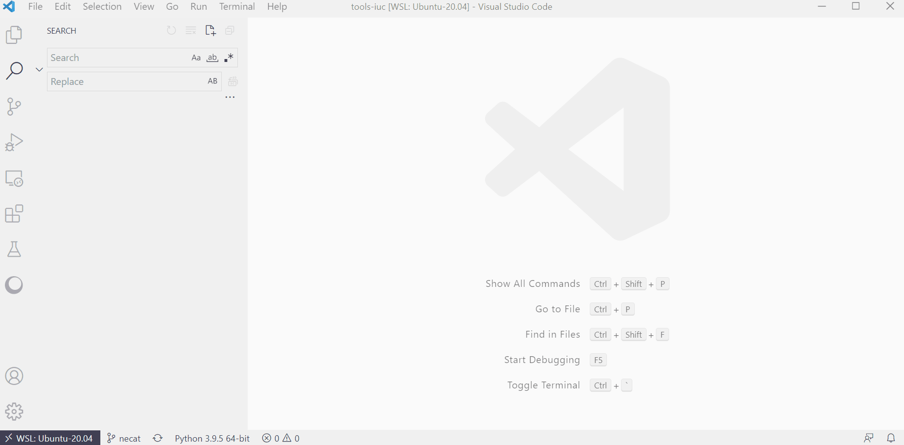
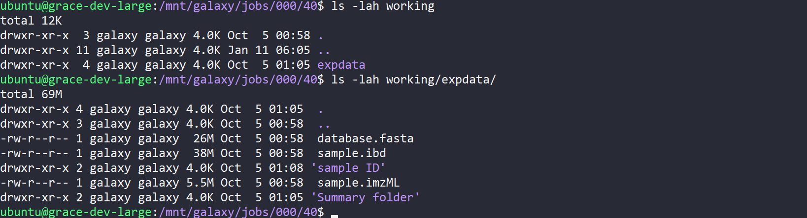
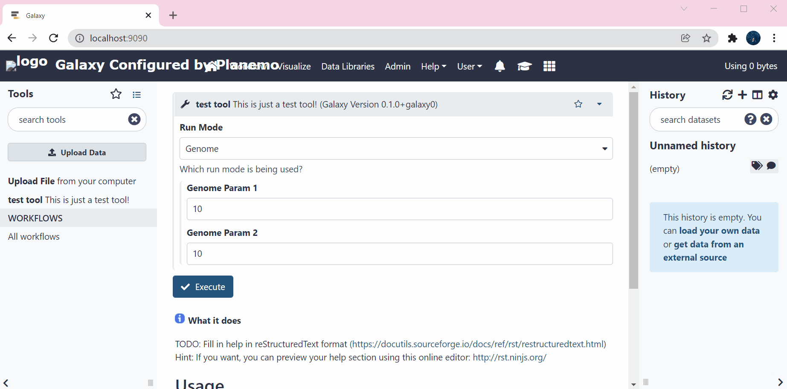
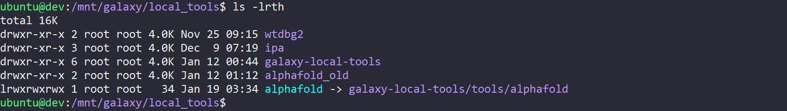
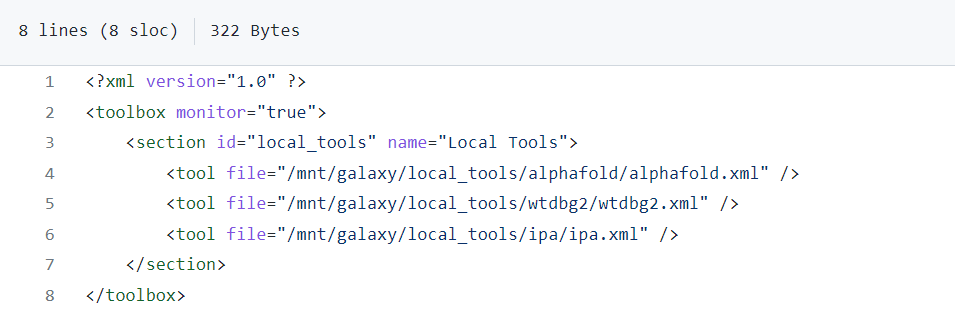

# Tool wrapping docs

## Preface

Wrapping bioinformatics programs for the Galaxy platform is challenging.
It requires good linux skills, and deep understanding of how Galaxy executes jobs.

This document is designed to provide a structure for learning tool wrapping. Much about this topic has already been written, so this document contains many links to relevant material. It also serves as an index for you to get help when stuck with a problem.

<br>

## Contents
* [Long Introduction](#long-introduction)
    * [Galaxy](#galaxy)
    * [Tool Wrapping](#tool-wrapping)
* [Short Introduction](#short-introduction)
* [Setup Your Development Environment](#setup-your-development-environment)
    * [IDE](#ide)
    * [Planemo](#planemo)
* [The Galaxy System](#the-galaxy-system)
    * [Overview](#overview)
    * [Job Destinations](#job-destinations)
    * [Job Execution](#job-execution)
    * [Datasets](#datasets)
* [Galaxy Tool UI](#galaxy-tool-ui)
    * [Metadata](#metadata)
    * [Params](#params)
    * [Structure Elements](#structure-elements)
    * [Outputs](#outputs)
    * [Tokens](#tokens)
    * [Macros](#macros)
    * [Dependencies](#dependencies)
    * [Command section](#command-section)
    * [Configfiles](#configfiles)
    * [Tests](#tests)
* [Tool Wrapping Process](#tool-wrapping-process)
    * [Before You Wrap](#before-you-wrap)
    * [Process](#process)
    * [Submission](#submission)
    * [Post-wrapping tasks](#post-wrapping-tasks)
    * [Getting Help](#getting-help)

<br><br>


## Long Introduction

### Galaxy

**History of command-lines and user interfaces**

Think back to the first business computers. At this time, humans interacted with computers using a command-line interface (CLI) running on a terminal. There was no graphical-user-interface, or 'GUI' which allowed anyone to walk up and use the system. Simply using a computer required formal training and expertise.

Graphical user interfaces (GUIs) really changed the game as they allowed more people to jump in. People could use the system and have a go, without first getting bogged down in learning how to use the operating system or program from the command line. Sure, people still needed to learn how to use programs (eg word processing) by clicking around, but this proved much more accessible than the command line.

Fast-forward to today, and everything is a GUI. Very few people who use computers actually ever touch the command line anymore. Could you imagine facebook being only accessible from the command line (this is possible btw)? No one would use it. Its just not accessible enough for the average person to use.

**CLI and Bioinformatics**

One field where the CLI still dominates is bioinformatics. While there are some web-servers like BLAST which make life easier, the majority of bioinformatics is still performed on the command-line. Some software tools even require knowledge of a specific programming language (usually R) in order to run them.

The are many reasons why bioinformatics tools mainly exist on the command line.
Firstly, they usually only do 1 thing. No point in creating a GUI if all the program does is press a big 'run' button after providing some settings. Secondly, the code is often written by PhD candidates and research groups researching a specific area of biology. Not many people in these situations are industry-grade software engineers with a computer science background. Thirdly, GUIs are expensive and funding could pose an issue.

This situation is somewhat unfortunate. As computational analysis is now present in most published research projects, the above presents a large barrier. Without an embedded bioinformatician, wet-lab scientists wishing to analyse their data would first need to spend months learning programming and linux skills in order to execute the tools require for their analysis.

**Galaxy: bringing bioinformatics into the GUI era**

Cue Galaxy. Galaxy's mandate is to bring bioinformatics into the GUI era. Galaxy has become a major platform where people can do bioinformatics (even complex analysis pipelines and workflows) without using the command line or writing scripts. By providing a GUI, galaxy will open the door for countless researchers and hopefully the general public to get involved with bioinformatics and to run their analysis.

<br>

### Tool Wrapping

**What is tool wrapping?**

At its core, Galaxy allows users to run (theoretically) any bioinformatics analysis on the web using a GUI. It has many great features like creating workflows and providing a data sharing platform, but the core functionality is to run programs without the command line.

Tool wrapping is the process of writing a definition for a program (currently using XML) which allows the software to be run via GUI on galaxy. This incorporates how the galaxy UI will look when users go to run the tool (customising the tool form), and some CLI related code & logic which allows the tool to actually be run under the hood.

**Why wrap tools?**

Wrapping a tool for the galaxy platform is like unlocking a new character in a video game. It enriches the ecosystem, and provides users with new abilities. To reiterate the previous sections, the aim of The Galaxy Project is to provide a GUI. If a galaxy user needs to run a certain bioinformatics tool in their analysis but its not available on galaxy, it needs to be wrapped! This is a continual process as new, or more powerful tools are regularly created within the field.

Currently, the pace of new tool development outmatches the rate they can be wrapped for the Galaxy system. This means we must prioritise tools which are likely to have high impact. More on this later in the __TOOLS__ section.

**How do users benefit from new tool wrappers?**

Galaxy has 3 main types of users: Large research initiatives, research groups, and students.

The first group is multi-researcher projects. These large projects / initiatives will sometimes partner with a galaxy server to process many samples in a pipeline. In these cases, all tools in the pipeline need to be available on that server. Often most of the tools will be available, but a few may need to be wrapped. These tools become high-priority in terms of wrapping as they enable an entire pipeline, and because the project is held up until they are available.

The second group is individual researchers or research groups. This group often wants to run a few relatively straightforward analyses on data they have generated in the lab. While the analysis might be seen as routine, there are few situations where a single cover-all 'best practise' workflow is available. Analysis pipelines are often tailored per analysis, and as such the group will often wish to include a number of shiny new tools from their field which are not yet available on Galaxy. This is a similar situation to the above, where wrapping these tools enables an analysis pipeline, and brings greater functionality to Galaxy in that field.

The final group is students / learners. Teaching students about Galaxy brings a huge number of new people to the table, and is incredibly important for its continual growth. Students usually learn routine workflows where all tools are available, but wrapping is still implicated for this group! Making sure new wrappers are high quality and well documented serves makes them easier to use and understand. This serves a core tenet of Galaxy - accessibility - as tool wrappers are supposed to make bioinformatics easy. A wrapper which has poor documentation and bad UI doesn't do a good job of making the tool accessible, and may be less usable than the command line in some extreme cases!

<br><br>

## Short Introduction

Galaxy's mandate is to bring bioinformatics into the GUI era. Galaxy has become a major platform where people can do bioinformatics (even complex analysis pipelines and workflows) without using the command line or writing scripts. By providing a GUI, galaxy will open the door for countless researchers and hopefully the general public to get involved with bioinformatics and to run their analysis.

Tool Wrapping is the process of making a tool runnable on galaxy. This includes understanding the tool's dependencies, command line format (options), writing a galaxy UI tool form, and writing tests to prove it all works.

<br><br>

## Setup Your Development Environment

To develop tool wrappers, you need a good IDE to write XML and search, and a system to test the wrappers you have built. <br>
***Visual studio code*** is recommended for wrapper development, and ***planemo*** is recommended to test your work.

### IDE


Visual Studio Code (VSC) is highly recommended
- Has a Galaxy extension (ext name: 'Galaxy Tools')
    - Provides code snippets (to make boilerplate tool, write gx-tool and select)
    - Tag and attribute auto-completion
    - Documentation on hover

    <br>
    

- Allows searching for use-cases or examples in tool XML:
    - Clone the [tools-iuc github](https://github.com/galaxyproject/tools-iuc)
    - Open the cloned repo with VSC
    - Use the search tool (left side nav button) for something you want to see an example of
    - Example: searching 'type="data_collection"' will show you examples of data_collections in use in tools-iuc.

    <br>
    

<br>

### Planemo

https://planemo.readthedocs.io/en/latest/

Planemo allows you to check and test your wrapper. <br>
There are 3 main functions to discuss: lint, test, serve.

**Installation**

```
# create env for planemo
python3 -m venv planemo

# load that env
$ source planemo/bin/activate

# install planemo into env
pip install planemo
```

DO NOT INSTALL PLANEMO USING CONDA IT DOESN'T WORK. ONLY PIP.

**planemo serve**

https://planemo.readthedocs.io/en/latest/commands/serve.html

The first command to use is 'serve'. This command runs a containerised galaxy instance and serves it on localhost:9090. planemo serve is useful because it loads tool XML files and presents them as on a real server, so we can look at the wrapper UI we are currently working on.

To use, navigate to a folder containing a tool XML file.
Execute the following:

```
planemo serve
```

It will take some time, but eventually will build galaxy and serve on localhost:9090. Look in the galaxy tools panel on the left side of your screen - you should see the tool you are working on.

If the tool UI doesn't look right, make your change in the tool XML file, then refresh localhost:9090. The change should have been reflected in the running galaxy instance.  

**planemo lint**

https://planemo.readthedocs.io/en/latest/commands/lint.html

The 'lint' command tests whether the tool XML violates any rules.
For example, each tool XML needs tests. If no tests are found in the XML, planemo will report it and fail the linting process.

To test, navigate to a folder containing a tool XML file.
Execute the following:  

```
planemo lint [tool_XML_file]
```

This will report any errors with the XML. These errors need to be addressed before submission.

**planemo test**

https://planemo.readthedocs.io/en/latest/commands/test.html

Planemo test allows you to run tool XML tests and verify they pass.
This is probably the most important command.

To run tool tests, navigate to a folder containing a tool XML file.
Execute the following:  

```
planemo test [tool_XML_file]
```

This will read, then execute the tests you have specified within the `<tests>` tag in `tool_XML_file`.

Note:

Tool requirements need to already be installed when running planemo test. <br>
For example if you are wrapping the 'quast' tool, create and activate a conda environment for your development, and install 'quast' into that env. Then when you run `planemo test quast.XML`, the quast software will be available. This is actually similar to what happens when a job is run on galaxy.

If you are using a container for tool execution, supply the `--mulled-containers` option when running `planemo test`.

<br><br>


## The Galaxy System

### Overview

[galaxy training](https://training.galaxyproject.org/training-material/topics/admin/)

Galaxy is a complex system. For tool wrapping, we can mostly ignore how a galaxy instance is configured, but there are a few things which need to be touched on. These are:
- Job destinations
- Job execution, and
- Datasets in galaxy

<br>

### Job Destinations

[galaxy job destinations](https://training.galaxyproject.org/training-material/topics/admin/tutorials/job-destinations/tutorial.html)

Job destinations specify 'where' a job is run. It mostly concerns the configuration of a environment where the tool is actually executed.

As an example, we may specify that one of our destinations has the following:
- 4 cores
- 16 Gb RAM
- Uses conda to load packages

Any tools which are set to use this 'job destination' will be executed on a node which has those specifications.

Job destinations are mainly the realm of Galaxy Admins, so we usually don't have to worry about it. There are a few instances where it matters though:
- large computational resource requirement (resources)
- tool uses a container (containers)


**Resources**

If we have wrapped a tool which is for large genome assembly, we should communicate with the Galaxy Aus Admin that they should set up a job destination with many cores and heaps of RAM. They will install the tool we wrapped, create a destination with those resources, then will map the tool to use this destination.  

There is nothing to write in terms of the wrapper, and it doesn't affect the dev process, but for actual implementation its important to communicate the typical resource needs of the tool.

**Containers**

By default, Galaxy uses conda to resolve dependencies. If the tool you are wrapping is quast, you need to specify quast as a requirement in the XML. At runtime, Galaxy will then use conda to get the quast conda package you specified and install it, then it will execute the code in the XML `<command>` section.

For containers this is not the case. To actually use a container as a dependency (ie you're running the tool using an image), a job destination has to be set up to use containers. Again, this is the realm of Galaxy Admins, but it applies when developing the wrapper. For example, to run planemo test to check your wrapper, it wont pull the container you specified unless you provide the `--mulled_containers` option to `planemo test`.

<br>

### Job Execution

[galaxy jobs](https://docs.galaxyproject.org/en/latest/admin/jobs.html)

An important distinction to highlight is the difference between a Galaxy 'Job', and tool 'execution'. A Galaxy Job includes a large amount of metadata, reporting, dataset handling, and creating an environment where the tool can actually run. The actual tool is executed within the Job at a specific stage, after all the Job setup tasks are complete, and before the outputs are returned.

Galaxy creates a sandbox environment for each job. Aside from creating an environment, installing dependencies, and setting environment variables, this sandbox environment includes a base folder system for the job. Inside this folder system are the files and folders needed for tool execution, once everything has been set up.

It is very useful to check this folder when things aren't working. In this section we will talk about the main files and folders of interest.

**Job home directory**


This is the folder that ***Galaxy*** sees when it is running a job. It is the base folder and contains everything needed to run that job. This acts as a parent folder since it holds all the files and folders needed. The tool itself doesn't actually need to see most of these, so tool execution actually occurs in the `working/` folder.

**Tool Workdir**



The `working/` folder is where the tool actually runs. Anything in the `<command>` section of the tool XML is templated into a string, then that string is run using the `working/` folder as the home directory.

If you write `echo "hi" > hello.txt` in the `<command>` section of the tool XML, a file called `hello.txt` will appear in the `working/` directory. This is where the commands are run.

From the above (first command), we see that the tool which was run produces a single folder called `expdata/` when running. Inside `expdata/` (second command) we have some outputs like a fasta database and some mass spec data.

**Tool Script**


`tool_script.sh` contains the command line string you specified in the `<command>` section of the tool XML. It has now been templated by cheetah, and so has be condensed down to what will actually be run by the OS. Something to note here is that there are a lot of `.dat` files -> this relates to how Galaxy stores datasets. More on this below.   


There is another script file, generally called `command.sh` or `galaxy_[job_id].sh`. This script does everything else needed to run the job. If you actually look inside this file, you will see that this script actually sets up all the folders, files, dependencies and environment variables to create the job sandbox.  We don't often need to check this file, but if you want to know about the sandbox environment the tool is running in, all that info is plain to see in `galaxy_[job_id].sh`. As an example,if your tool uses a singularity container and you want to see how the bind paths were set up, all this information would be in `galaxy_[job_id].sh`

**Inputs**


The `inputs/` folder contains the input files which are needed for the job. This will include any data from the user history which was specified for use in the tool form. The actual name of the file from the user history has been replaced with the .dat file stored on disk by the Galaxy database.

**Outputs**


The `outputs/` folder contains the output files which have been collected. These are specified in the tool XML in the `<outputs>` section. Imagine that Galaxy finds these files and stages them in the `outputs/` folder before moving them to the user history.  

Depending on Galaxy setup, `outputs/` may also contains the tool `stderr` and `stdout`. These are captured when the tool is running, and will be the same as you would see on your console if running the tool locally. If not, `stderr` and `stdout` will be in the Job home directory.

**Configfiles**


The `config/` folder contains each `<configfile>` in the `<configfiles>` section of the tool XML. Configfiles are also templated by cheetah in the same manner as the `<command>` section, so when they appear in the `config/` folder, they are the plain text file which will can actually be run or used by the tool.

Similar to checking `tool_script.sh` to find how the tool is executed on the command line, checking the files in `config/` shows you how your configfiles actually ended up after all the variables and logic was assessed.

**Environment Variables & Job Setup**

Aside from files and folders, environment variables are set in the job sandbox. Many link to reserved variables which can be written in the tool XML, like `$__tool_directory__` which allows you to access files in the tool wrapper directory. An example of its use is placing small python programs which transform the tool output, or validate files into the tool wrapper directory, next to the tool XML. These programs would then be accessible at `$__tool_directory__/your_python_file.py`

See https://docs.galaxyproject.org/en/latest/dev/schema.html#reserved-variables for the full list of reserved variables.

All the non-reserved environment variables are set in `galaxy_[job_id].sh`. <br> An example is seen below, where some singularity and galaxy env variables are exported.  


<br>

### Datasets

All user and shared data in Galaxy is stored as `.dat` files. <br>
It doesn't matter if the file is a textfile, a tsv, a genome index, or a fasta. All data is stored in the data directory of the Galaxy server itself, at a seemingly random location.

When you upload a file to your history called `myfasta.fasta`, the file is stored as `.dat` in the Galaxy file system, then just creates a listing in its database which maps your credentials, the history, and the file id to the underlying data file it just stored.

This structure means that when you run a tool on `myfasta.fasta` from your history, Galaxy decodes where that actual file is, and ships it to the `inputs/` folder of the Job sandbox.

For this reason, you are not meant to interact with the data directory at all. When running a job, all relevant files have already been stage in the job `inputs/` folder ready for use. The names of these files don't even matter, as they are mapped to `$variable_name` you specified for that input in the tool XML.

This does have an implication for file types. Many bioinformatics tools will try to check file types at runtime using the file's extension. As the extension of the underlying file is always `.dat`, this often results in a failed job.

To skirt this, just symlink the input file to a more appropriate name.
Executing `ln -s $input_reads input.fastq` at the start of the `<command>` section of the tool XML, then running the tool on `input.fastq` will present the file as `input.fastq`, not the random `dataset_11146.dat` filename which Galaxy provided.

<br><br>

## Galaxy Tool UI

On the topic of Tool UI, a famous wrapper dev said the following.

*“Give people flexibility, while guiding them away from stupid mistakes”*

Aside from being a great line, this expresses one of the core tenets of Galaxy - accessability. We want Galaxy to be as straightforward to use as possible, and a big responsibility rests on the wrappers we develop. We aim to encapsulate the tool options in an intuitive way, so that it feels effortless to set up a job and run the tool on Galaxy.

There are three main pieces of reference material we will refer to in this section. They are the:
- [Tool dev training slides](https://training.galaxyproject.org/training-material/topics/dev/tutorials/tool-integration/slides.html#1)<br>
- [Galaxy Tool XML documentation](https://docs.galaxyproject.org/en/latest/dev/schema.html)<br>
- [Planemo Documentation](https://planemo.readthedocs.io/en/latest/writing.html)

<br>

### Metadata

**Tool ID, Name and Version**

The first line of tool XML is a `<tool>` tag. Here we state the id, name and version.
Tool ids need to be unique, so search [the toolshed](https://toolshed.g2.bx.psu.edu/) to ensure this is the case. The tool version (usually set with `@TOOL_VERSION@` token) should correspond to the version of the software tool being wrapped (the main dependency). The version suffix (usually set with the `@VERSION_SUFFIX@` token) corresponds to the version of ***the wrapper itself***. The first wrapper will have `@VERSION_SUFFIX@ = 0`.

Here is an example from the quast tool:

```<tool id="quast" name="Quast" version="@TOOL_VERSION@+galaxy@VERSION_SUFFIX@" profile="20.01">```


<br>

**EDAM topics & operations / biotools**

[galaxy docs](https://docs.galaxyproject.org/en/latest/dev/schema.html#tool-edam-topics)

To properly define a tool and what it does, we use the EDAM ontology. This provides a single point-of-truth system to desbribe tools using a defined set of terms.  

An EDAM topic denotes something like a field of interest or an area of study.
for example, the circos tool wrapper lists:
- topic_0797: comparative genomics
- topic_0092: data visualisation

An EDAM operation is a transformative process, usually processing of data. The circos wrapper lists:
- operation_0337: visualisation

These are specified using the `<edam_topic>` and `<edam_operation>` tags.
If a bio.tools listing for the tool exists, we can just point to that listing and the EDAM information will be transferred to our tool. In this case we use a `<xref>` tag.

Together, these provide useful metadata about the tool, but also have a practical purpose. The tool panel of Galaxy servers can be structured according to the EDAM ontology, so that tools are automatically grouped in a logical way for users.

Relevant links:<br>
Searching for relevant EDAM topics & operations - https://www.ebi.ac.uk/ols/ontologies/edam<br>
Quast bio.tools listing - https://bio.tools/t?page=1&q=quast&sort=score

<br>

**Citations**

[galaxy docs](https://docs.galaxyproject.org/en/latest/dev/schema.html#tool-citations)

Each tool needs at least 1 `<citation>`. At the least, a doi which points to the original paper describing the tool. Both `type="bibtex"` and `type="doi"` citations are possible. A github link is also useful if available, but this is placed in the `<help>` section.

See bwa-mem.xml for an example on ***bibtex*** citations.

<br>

**Help**

[slides](https://training.galaxyproject.org/training-material/topics/dev/tutorials/tool-integration/slides.html#29)<br>
[galaxy docs](https://docs.galaxyproject.org/en/latest/dev/schema.html#tool-help)<br>
[planemo docs](https://planemo.readthedocs.io/en/latest/standards/docs/best_practices/tool_xml.html#help-tag)

Making sure new wrappers are high quality and well documented serves makes them easier to use and understand. This serves a core tenet of Galaxy - accessibility - as tool wrappers are supposed to make bioinformatics easy. A wrapper which has poor documentation and bad UI doesn't do a good job of making the tool accessible, and may be less usable than the command line in some extreme cases!

<br>

### Params

[slides](https://training.galaxyproject.org/training-material/topics/dev/tutorials/tool-integration/slides.html#14)<br>
[galaxy docs](https://docs.galaxyproject.org/en/latest/dev/schema.html#tool-inputs-param)<br>
[planemo docs](https://planemo.readthedocs.io/en/latest/writing_standalone.html#simple-parameters)

Params appear in the Galaxy Tool UI Form (the Tool Form). They provide widgets so the user can provide input to customise tool settings and supply data from their history. Params also link this user input to the `tool.xml` `<command>` section, so that the tool script can be customised for that job.

We want the parameters to be clear and simple. This sometimes means that the underlying software tool's options are represented differently in the Tool Form.

An example - the tool being wrapped has 3 run modes: `--relaxed`, `--moderate`, `--strict` .
Rather than providing 3 `type="boolean"` params to switch these on or off individually, we might create a single `type="select"` param with `name="run mode"`. This offers a simple dropdown containing the three 'run mode' options, as only 1 can be selected at a time. If multiple are selectable, you could supply the `multiple="true"` attribute in the xml tag.

<br>

### Structure Elements

Tool XML Structure elements greatly enhance wrapper usability. They group params into logical sections, and hide / reveal settings depending on what the user has selected.

Here we will discuss the `<section>`, `<conditional>` and `<repeat>` tags.

**Section**

[slides](https://training.galaxyproject.org/training-material/topics/dev/tutorials/tool-integration/slides.html#34)<br>
[galaxy docs](https://docs.galaxyproject.org/en/latest/dev/schema.html#tool-inputs-section)

Sections group params together. The grouping is reflected in the Tool Form, with each section getting a heading. Each section can be collapsed or revealed.  A common pattern is to split the Tool Form into base settings, and an 'Advanced' `<section>` of settings.

```
<section name="advanced" title="Advanced" expanded="false">
```

If 90% of the time users don't interact with the settings in the 'Advanced', the Tool Form UI is much cleaner and easy to use this way. Due to `expanded="false"` the section is collapsed when the page loads, and internals are hidden.

**Conditional**

[slides](https://training.galaxyproject.org/training-material/topics/dev/tutorials/tool-integration/slides.html#22)<br>
[galaxy docs](https://docs.galaxyproject.org/en/latest/dev/schema.html#tool-inputs-conditional)<br>
[planemo docs](https://planemo.readthedocs.io/en/latest/writing_standalone.html#conditional-parameters)

Conditional params dynamically change the look of the Tool Form based on user input. They are used to guide users to make fewer mistakes, and also provide a more clean UI.

Conditional params are especially useful where a group of tool settings only becomes relevant when another setting takes a specific value. An example is a tool which has 'genome', 'transcriptome', and 'metagenome' options. When running the tool in 'transcriptome' mode, the 'genome' and 'metagenome' become irrelevant. We could make these groups of settings appear and disappear doing the following:

```
<conditional name="runmode">
    <param name="mode" type="select" label="Run Mode" help="Which run mode is being used?">
        <option value="genome">Genome</option>
        <option value="transcriptome">Transcriptome</option>
        <option value="metagenome">Metagenome</option>
    </param>
    <when value="genome">
        <param name="genome_param_1" type="integer" value="10" label="Genome Param 1" />
        <param name="genome_param_2" type="text" value="10" label="Genome Param 2" />
    </when>
    <when value="transcriptome">
        <param name="transcriptome_param_1" type="integer" value="100" label="Transcriptome Param 1" />
    </when>
    <when value="metagenome">
        <param name="metagenome_param_1" type="data" format="fasta" label="Metagenome Param 1" />
        <param name="metagenome_param_2" type="float" value="32.6" label="Metagenome Param 2" />
    </when>
</conditional>
```


<br>

**Repeat**

[slides](https://training.galaxyproject.org/training-material/topics/dev/tutorials/tool-integration/slides.html#23)<br>
[galaxy docs](https://docs.galaxyproject.org/en/latest/dev/schema.html#tool-inputs-repeat)<br>

The `<repeat>` tag is useful when settings are supplied in lists/arrays.  An example is the `circos` tool. Circos allows you to add as many data inputs as you like, and customise the settings and plot appearence for each data input. You can infinitely add more data inputs as the relevant settings are wrapped in a `<repeat>` tag. For example, to add another Link Data Track, just click the `+ Insert Link Data` button in the Tool Form.

<br>

### Outputs

Outputs appear in the user history. They are defined in the `<outputs>` tag of the Tool XML. They can be single files specified as `<data>` elements, or `<collection>` of files.  

Specifying the outputs for a tool is relatively straightforward, but ensuring Galaxy collects and organises the right files from the job working directory for each output can be challenging.

In this section, some links are provided to learn the basics, then some more challenging cases are discussed.

**data vs collection**

slides: [data,](https://training.galaxyproject.org/training-material/topics/dev/tutorials/tool-integration/slides.html#24) [collection](https://training.galaxyproject.org/training-material/topics/dev/tutorials/tool-integration/slides.html#70)<br>
galaxy docs: [data,](https://docs.galaxyproject.org/en/latest/dev/schema.html#tool-outputs-data) [collection](https://docs.galaxyproject.org/en/latest/dev/schema.html#tool-outputs-collection)<br>
planemo docs: [collection](https://planemo.readthedocs.io/en/latest/writing_advanced.html#creating-collections)<br>

`<data>` outputs are single files. Each `<data>` output will appear seperately in the user history.

Imagine your tool produces a fastq file and a html report as output. In this situation, you would declare both these files as individual `<data>` outputs. This is the most straightforward approach to outputs, and should be considered first when writing your wrapper.

On the other hand, a `<collection>` is an array of files. We can choose if they're an array of paired files (eg forward and reverse read mate pairs), or just a flat list.

Collections are good in a number of situations.  If the tool accepts an input array of files (a collection) as a batch, it may also produce an array (collection) of outputs, where each output has a corresponding input.

Collections also make sense for certain tool outputs. Alphafold produces five folded models per input protein - as these are all the same file type, it is nice to contain them in a 'models' `<collection>` so the user history isn't spammed with 5 outputs.

Note:

`<collection>` outputs often do not work when the job destination is a [pulsar](https://training.galaxyproject.org/training-material/topics/admin/tutorials/pulsar/tutorial.html) node.

**file gathering**

When an output is declared, we need to tell Galaxy how to actually find that file in the working directory. We can do this in three different ways: variable references, paths, and patterns.

*variable references*

One of the most simple methods is just using a variable reference. This is kinda magic because you don't need to specify a file path - just the name of the output variable in the <command> section. See below.

```
<command>
    python my_program.py > $out_file
</command>

...

<outputs>
    <data name="out_file" format="fasta" />
</outputs>
```

In this example, `my_program.py` is a python program which prints to `stdout`. In the `<command>` section, we see this is being redirected into `$out_file`.

In the `<outputs>`  section we have declared a `<data>` output with the name 'out_file'. This output would therefore be accessible in the `<command>` section using its variable form: `$out_file`.

Piecing the above together, Galaxy actually has everything it needs to properly gather the required file and put it into the user history. It may seem like magic, but Galaxy is smart enough to know that `$out_file` is the `name="out_file"` output declared in `<outputs>`, so just links the two.

Under the hood, I believe this occurs by creating and linking temp files, but am not 100% sure.

*paths*

Another way to specify the file location for an output is via a local path.
If your tool produces a file called `report.html` in the working directory, we can specify to collect that file using `from_work_dir=""`. See below:

```
<data name="html_out" from_work_dir="report.html" format="html" label="html report" />
```

This specifies that `./report.html` is the file to be gathered for the output.

*patterns*

Sometimes file paths are not fixed, or more than one file should be collected. In these situations we need to use a pattern to find files. The `<discover_datasets>` tag is used to discover these files, by providing `pattern="your_pattern_here"`. `<discover_datasets>` can be used to create multiple outputs at runtime based on how many files are discovered, or can be used to populate a `<collection>` output with the files for that collection.

We will talk about this more below when referring to **dynamic outputs**.

**static vs dynamic outputs**

planemo docs: [static](https://planemo.readthedocs.io/en/latest/writing_advanced.html#static-multiple-outputs), [dynamic](https://planemo.readthedocs.io/en/latest/writing_advanced.html#dynamic-numbers-of-outputs)

In the above sections we have just focused on static outputs. This is where we expect 1 user history output per 1 `<data>` or `<collection>`. Sometimes this isn't flexible enough, and we want to create a dynamic number of user history items, or dynamically gather files into a collection. To accomplish this, the `<discover_datasets>` tag can be nested inside an output tag.

`<discover_datasets>` can be used with both `<data>` or `<collection>` outputs, but they do different things. When using with a `<data>` output, multiple user history items are created: one per discovered file. When using with a `<collection>` output, the pattern gathers all the files which will be placed into the collection.

The `pattern=""` attribute of a `<disover_datasets>` tag serves two purposes: to locate files for collection in the working directory, and to dynamically assign a name for each collected file. To accomplish this, Galaxy has its own flavour of regex patterns. [See here](https://planemo.readthedocs.io/en/latest/writing_advanced.html#examples).

The tools-iuc wrapper for samtools_stats shows examples for both `<data>` and `<collection>` outputs using `<discover_datasets>`.


**extra features**

*turning outputs on/off*

Sometimes we have optional outputs we only want to display in certain situations. To accomplish this, we can write simple python logic to tell Galaxy when an output should be ignored. See the `<filter>` [slides](https://training.galaxyproject.org/training-material/topics/dev/tutorials/tool-integration/slides.html#26) and [galaxy docs](https://docs.galaxyproject.org/en/latest/dev/schema.html#tool-outputs-data-filter).

*outputs with unknown data format*

From planemo docs:

"If the output format of a tool’s output cannot be known ahead of time, Galaxy can be instructed to “sniff” the output and determine the data type using the same method used for uploads. Adding the auto_format="true" attribute to a tool’s output enables this."

```
<output name="out1" auto_format="true" label="Auto Output" />
```

<br>

### Tokens

[slides](https://training.galaxyproject.org/training-material/topics/dev/tutorials/tool-integration/slides.html#61)<br>
[planemo docs](https://planemo.readthedocs.io/en/latest/writing_advanced.html#parameterizing-xml-macros-with-tokens)

Tokens are variables which can be reused within XML tags themselves. They are handy to avoid repetition. This has two benefits: it ensures the variable value is constant across the whole document, and allows the variable to be reassigned by only modifying the token, rather than all the place the token is used.

As an example, in abricate.xml, `@VERSION@` is set to 1.0.1. This token is then used in 2 places
```
macros.xml: line 13
<token name="@VERSION@">1.0.1</token>

abricate.xml: line 1
<tool id="abricate" name="ABRicate" version="@VERSION@" profile="@PROFILE@">

macros.xml: line 4
<requirement type="package" version="@VERSION@">
```

<br>

### Macros

[slides](https://training.galaxyproject.org/training-material/topics/dev/tutorials/tool-integration/slides.html#59)<br>
[planemo docs](https://planemo.readthedocs.io/en/latest/writing_advanced.html#macros-reusable-elements)

Macros are snippets of XML. They are used for two main reasons: readability, and reuse of XML code.

To improve readability, big sections of XML can be moved to the wrapper's `macros.xml` file. Here they are declared as a `<macro>`. This moves the section out of the main XML document, and allows it to be injected where it is needed. This can make the main XML doc much more clear and concise.

Another reason is reuse of XML code. This is the same motivation as seen in all programming - duplication is bad and annoying. Just declare the XML section once as a macro, then inject the macro in the multiple locations it is needed in the main XML document.

<br>

### Dependencies

[slides](https://training.galaxyproject.org/training-material/topics/dev/tutorials/conda/slides.html#6)<br>
[galaxy docs](https://docs.galaxyproject.org/en/latest/dev/schema.html#tool-requirements)<br>
planemo docs: [conda](https://planemo.readthedocs.io/en/latest/writing_advanced.html#dependencies-and-conda), [containers](https://planemo.readthedocs.io/en/latest/writing_advanced.html#dependencies-and-containers)

Dependencies are all the pieces of software needed to run a tool. When wrapping a tool for Galaxy, there is almost always at least one dependency: the tool itself. Keep in mind that when running a job, a blank-slate sandbox is created. Galaxy then installs any software required into that environment so the tool can be executed.

The `<requirement>` tag is used to specify dependencies. Galaxy allows two different approaches for handling dependencies: through **conda**, or **containers**.

*anaconda*

As of Jan 2022, the preferred way to handle dependencies is through conda. Imagine that when your job will run, a conda environment is created and activated, then any package listed as a `<requirement>` in the Tool XML is installed into the environment. This allows multiple dependencies, and ensures that when the tool is actually executed, all software has been installed.

*creating conda recipes*

If a tool is high priority but does not yet have a conda package, you can create one using a recipe. For tutorials, see the [planemo documentation](https://planemo.readthedocs.io/en/latest/writing_advanced.html#building-new-conda-packages), and the [GTN youtube video](https://www.youtube.com/watch?v=UtNErGKw8SI) on this topic.   

*containers*

Sometimes containers are preferred over conda. Software conflicts may arise between individual `<requirements>` needed by the Galaxy wrapper, or a conda package may not exist and be hard to create. In these cases, containers are used if available.

The easiest approach is using a single container dependency. If the software developers responsible for the tool being wrapped have created a publically available container, they have usually included everything needed for tool execution. Its rare that a container needs modification for the Galaxy wrapper.  

Always specify the container image to a specific commit, eg `your_tool:SHA@od81knd1od` rather than a tag like `your_tool:latest`. This ensures the same container will be executed every single time, rather than a new version.

When the Job is executed, Galaxy will pull and run the required container. From the perspective of what to write in the Tool XML `<command>` section, imagine that you have shelled into the container. Access the software tool as if you have it installed as a package - for example if you are using a `quast` image as a container requirement, writing `quast input.fastq ...` will just work. Writing something like `singularity run ...` inside the `<command>` section is like trying to execute a container ***inside*** of the container which has already been loaded when the job is created!

Write the wrapper as if all docker / singularity container setup options are correct. Galaxy automatically does things like binds the job `working/` dir to the container `~/` dir.  For most tools, these options should be enough to get the tool running. Adding extra docker / singularity options is possible, but gives Galaxy admins more work as a custom job destination has to be set up on the Galaxy Server running the tool.  

If you need to set up specific singularity / docker options (eg specific bind paths above the defaults), these are specified in the JOB DESTINATION where the tool will run on the Galaxy server, not the Galaxy wrapper itself. In `code_snippets/job_conf.yml.j2` we see the following `pulsar-eu-gpu-alpha` job destination for `alphafold`:

```
execution:
  environments:
      pulsar-eu-gpu-alpha:
        singularity_run_extra_arguments: --nv
        singularity_volumes: "$job_directory:ro,$tool_directory:ro,$job_directory/outputs:rw,$working_directory:rw,/data/alphafold_databases:/data:ro"
```

We have set `--nv` which sets up the container to use CUDA libraries with a NVIDIA GPU. We also added some extra volumes to bind, on top of the defaults.
This is sometimes unavoidable, but would require a Galaxy admin to configure this destination on their server to run `alphafold`


<br>

### Command section

The tool XML `<command>` section is essentially a bash script with extra functionality. Most importantly, it contains the command-line statements needed to execute the software tool being wrapped. The `<command>` section should be written in a manner that allows it to dynamically respond to whatever parameters the user sets in the tool UI form.

This is possible because each `<param>` and everything in the `<outputs>` section is available as a variable in the `<command>` section. See the following example:

```
<param name="input_fastq" type="data" format="fastq" label="Input reads" />

<section name="advanced" title="Advanced Settings" expanded="false">
    <param name="min_read_length" type="integer" value="80" label="minimum read length" />
</section>
```

We have 2 params: `input_fastq` and `min_read_length`.

`input_fastq` is a fastq which the tool will act on. It's final value (the fastq dataset the user supplies) will be available in the command section as `$input_fastq`

`min_read_length` is an integer param which sets min read length. It's final value set by the user (or defaulting to '80') would be available in the command section as `advanced.min_read_length`. Note here that it is nested inside a `<section>` tag, so it's variable name reflects this heirarchy. The same is true for `<conditional>` and `<repeat>` tags.


<br>

**Cheetah basics**

[cheetah docs](https://cheetahtemplate.org/users_guide/intro.html)<br>
[python docs](https://pythonhosted.org/Cheetah/)<br>
[galaxy docs](https://docs.galaxyproject.org/en/latest/dev/schema.html)

As the `<command>` section needs to be very dynamic, the ***cheetah*** templating language is used. This  permits useful features like conditional logic and the variable injection we saw above.

As an example - if we sometimes want to produce an extra history output when the tool is run based on user input, we might see something like the following:

```
#if $should_produce_summary:
    cut -f1,4,5,6 output.sam > summary.tsv &&
end if
```

This will see if the `$should_produce_summary` param was `true`. This will most likely be a `type="boolean"` param, which presents itself as a on/off check button in the tool form UI.  If the user has this checked, it will execute the code on the line below to produce a summary file. The `&&` is just so that we can execute another statement after this, which is often necessary as most tool wrappers execute multiple statments.

The best way to learn cheetah and its use in tool XML is to search tools-iuc. Example: if you want to see how a cheetah function is declared, seach '#def ' in the tools-iuc repo. Any tool declaring a cheetah function will appear, giving you a bunch of use-cases to learn from.

<br>

**Preprocessing**

Before the actual tool is run, preprocessing is often needed.
This may be to symlink files, to echo text, or to format a user input.
It is common to see something like the following:

```
# preprocessing
export LC_ALL=C && kraken --version &&
if [ -d '${kraken_database.fields.path}/${kraken_database.fields.name}' ]; then export KRAKEN_DEFAULT_DB='${kraken_database.fields.path}/${kraken_database.fields.name}'; else export KRAKEN_DEFAULT_DB='${kraken_database.fields.path}'; fi &&

# tool execution
kraken --threads \${GALAXY_SLOTS:-1} ...&&

# extra outputs created by a python script
python kraken_taxonomy_report.py ...
```

The above was taken from the `kraken` tool. We set an environment variable, then created the kraken_database path using some bash conditional logic.

<br>

**Tool execution**

Writing the statements which execute the tool itself within the `<command>` section is one of the more straightword aspects. If you understand how the tool works and its options, writing the logic should be possible.

Try to ensure that your code can't break the syntax of the tool - eg depending on user input, your wrapper `<command>` section can create an invalid command-line string (due to including options that cannot appear together etc).  The best way to ensure this is to look carefully at the default `value` of each param, whether they are `optional`, and through writing good `<tests>` for your wrapper during development.

<br>

**Postprocessing**

After the main tool has run, sometimes we wish to add a postprocessing step. This may be calling another piece of software to create an output report, to translate a file into another format, or simply to move files around the folder structure.

<br>

**Tricky Cases**

There are many challenging scenarios that appear. The best way to find workarounds is by searching within `tools-iuc` to see whether someone has already solved your problem. If not, you may need to come up with your own clever workaround for the issue. We often find that ***symlinks*** are highly useful in skirting tough scenarios.

Have a look through the usegalaxy-au/galaxy-local-tools documentation on [tricky cases and workaround patterns.](https://github.com/usegalaxy-au/galaxy-local-tools/blob/master/patterns.md)

<br>

**Best-practises**

Once you have started tool wrapping, you will quickly realise there are good / bad strategies for doing things. See the links below to learn the current top standard for Galaxy tool wrappers.

[tools-iuc best practices](https://galaxy-iuc-standards.readthedocs.io/en/latest/best_practices/tool_xml.html)<br>
[tool wrapper test-driven-development](https://planemo.readthedocs.io/en/latest/writing_advanced.html#test-driven-development)

<br>

### Configfiles

The `<command>` section is how we traditionally link user input to a command-line string in order to run a tool. But what if those user settings correspond to something like an R or python script? If the R / python file itself needs to be dynamically templated, we use a `<configfile>` rather than the `<command>` section to do this.

Configfiles operate in exactly the same way as the `<command>` section, except it is a file you are templating. If you then wish to 'run' that file, you simply refer to it in the `<command>` section. For example (from the volcanoplot tool), if we have a `<configfile>` called `volcanoplot_script` containing some R code, we can simply write `Rscript $volcanoplot_script` in the `<command>` section and the code will execute.

Inside the `<configfile name="volcanoplot_script" />` configfile, we would have the basic logic set out, and all the galaxy UI user params would be present in their `$variable` form to grab their values.

<br>

### Tests

[slides](https://training.galaxyproject.org/training-material/topics/dev/tutorials/tool-integration/slides.html#41)<br>
[galaxy docs](https://docs.galaxyproject.org/en/latest/dev/writing_tests.html)<br>
[planemo docs](https://planemo.readthedocs.io/en/latest/test_format.html)<br>
[planemo test-driven-development](https://planemo.readthedocs.io/en/latest/writing_advanced.html)

Tests are important. They ensure the tool can be successfully installed on a Galaxy server, and also confirm that the wrapper is working correctly!

Each tool must have at least 1 test. 2+ tests are recommended - one basic test, and at least one other which includes some tool options. Having more tests is generally better, at around max of 7 for complex tools.

tools-iuc impose a 500kb file size for test-data - dont exceed this if possible!<br>
Generic test datasets (<500kb) can be found in [galaxy-local-tools test-data](https://github.com/usegalaxy-au/galaxy-local-tools/tree/master/test-data. )
<br>This folder also includes some information about software tools which allow you to subset data - eg samtools view to create BAM/SAM slices.

<br><br>

## Tool Wrapping Process

NOTE: See the galaxy-local-tools [tool wrapping checklist](https://docs.google.com/document/d/1Sf2zl7wBqb0RsVhQNVfrrKFQERVO3PEn7_-ALSARj2I/edit#) for a step by step guide.

### Before You Wrap

Before wrapping the tool, a few checks need to be made. Primarily, we want to see if a wrapper is already available, and if not, whether someone else is already developing one. Additionally, sometimes tool wrapping isn't possible due to technical or time reasons.

**Searching for Wrappers**

The first thing to do is search for an existing wrapper. Do these 4 quick searches to make sure it isn't already available:

- Search the [toolshed](https://toolshed.g2.bx.psu.edu/)
- Search the toolshed for a similar name (eg wtdbg vs wtdbg2 situation)
- Google the tool name + galaxy
- Search the [tools-iuc issues page](https://github.com/galaxyproject/tools-iuc/issues) to see if someone is actively wrapping the tool.

If you didn't find anything, raise an issue in the [tools-iuc issues page](https://github.com/galaxyproject/tools-iuc/issues) to declare you are now working on wrapping this tool.

**Identifying time-consuming tools**

Some tools are extremely challenging to get running on Galaxy. This isn't necessarily obvious when starting the tool wrapping process, but there are a couple red flags to keep in mind. The tool wrapping process can be cancelled or put on hold at any stage, but it is better to identify these situations early.

The examples below are to get a feel for whether the tool will be easy / hard. Having one of these is no issue, but when multiple are present it suggests the tool may be challenging to install / run on Galaxy.

Red flags:
- Dependencies
    - Many dependencies (>5), including R libraries etc <br>
    - GCC or other compilers
    - Perl scripts
    - Autoconf / automake
    - [Long installation scripts](https://github.com/MASHUOA/HiTMaP#codes-for-linux-os-building-enviornment) in general
- Code body
    - 'Hello world' example code doesn't run
    - Errors experienced when running basic inputs
    - Uninformative error messages / crashes with no error report

Due to the growing trend of containerisation, some of the hard-to-install tools due to dependencies / environment setup are now able to run. A container may have been recently created for a legacy tool, or a new tool with challenging requirements may have a container available on release. Consider using a container for challenging tools before putting them on hold.

Containers mainly solve issues related to dependencies - if the underlying code body itself is buggy and prone to failure, containers do not solve anything. In these situations, reach out to the developers by raising an issue in the tool github, but don't fix or improve their code via pull requests. Our responsibility is wrapping the tool they provide for Galaxy, not fix their own software issues!

<br>

### Process

[galaxy-aus tool wrapping checklist](https://docs.google.com/document/d/1Sf2zl7wBqb0RsVhQNVfrrKFQERVO3PEn7_-ALSARj2I/edit#)<br>
[planemo test-driven-development](https://planemo.readthedocs.io/en/latest/writing_advanced.html)<br>
[Planemo best practices](https://planemo.readthedocs.io/en/latest/standards/docs/best_practices/tool_xml.html)<br>

**Setup**

To begin, please create a new branch in [galaxy-local-tools](https://github.com/usegalaxy-au/galaxy-local-tools) and add a folder for your tool in the `tools/` directory. This github repo acts as our central version of truth, and we have found this process avoids many issues. Versioning also allows us to unwind changes that cause errors when developing the wrapper.  

**Development**

Tool wrapping is an iterative process. A wrapper starts in the most minimal form possible, then grows from that point. It is best to get the tool working for a basic/common use case, then progressively add new options and features.  Sometimes a tool can work in some capacity on galaxy but not others, and some functionality is better than none!

Write a test for each new development you make. Write the test ***before*** the associated XML code, then ensure it passes! This allows you to make meaningful developments, and guarantees the wrapper delivers the ***functionality*** you desire. Progressively writing then passing tests also ensures nothing breaks in the process!

For more details on tool wrapping, read the planemo and tools-iuc best practices guides above. Follow along with the galaxy-aus tool wrapping checklist while you are working to provide a framework and structure.

**Testing on the dev server**

It is recommended to test the tool with a real dataset on the dev server before submitting to the toolshed or tools-iuc. This is done through the galaxy-local-tools github.



In the image above, we have navigated to the local_tools directory on the dev server. This is a folder which allows local tools to appear in the Galaxy dev server, rather than everything else which is pulled from the toolshed.  

Navigate to the `galaxy-local-tools` directory, checkout to your development branch, then `git pull` to sync with the repo.  The only other thing to do is add a symlink like the one you see for alphafold so that Galaxy can access your tool.

```
sudo ln -s galaxy-local-tools/tools/[your_tool_folder] [your_tool_name]
```

After the tool is added to the dev server local_tools directory as a simlink, it will appear on the dev server after we have listed it in the [dev server local_tool_conf](https://github.com/usegalaxy-au/infrastructure/blob/master/files/galaxy/config/local_tool_conf_dev.xml) (see below)



<br>

Simply add another line to include your tool, then create a pull request. One of the Admin team will approve it relatively quickly, then it will be available on the dev server. It is a good idea to do this early in the wrapping process.

This process is still being properly fleshed-out. There is at least 1 issue with this approach, being that it needs constant switching between branches if more than 1 tool is being tested on the dev server at a time.

<br>

### Submission

**The Toolshed**

The toolshed is the central location for galaxy tools. Once a tool has been made available on the toolshed, it can be installed onto any Galaxy server worldwide.
Your tool therefore needs to be submitted to the toolshed to be available to Galaxy australia and the broader community.

There are two main ways to submit your wrapper to the toolshed. Via [tools-iuc](https://github.com/galaxyproject/tools-iuc) (recommended), or directly to the [toolshed](https://toolshed.g2.bx.psu.edu/) from [galaxy-local-tools](https://github.com/usegalaxy-au/galaxy-local-tools).

**.shed.yml**

[tools-iuc docs](https://galaxy-iuc-standards.readthedocs.io/en/latest/best_practices/shed_yml.html)

Whether submitting manually from galaxy-local-tools, or from tools-iuc, each tool wrapper needs a .shed.yml file. This file defines who created the wrapper, the tool being wrapped, its category, and a bunch of other necessary metadata.  The toolshed reads this file upon submission so it knows how to render your wrapper, and so that all the important information is present.  

**submission via tools-iuc**

[tools-iuc readiness checklist](https://galaxy-iuc-standards.readthedocs.io/en/latest/best_practices/integration_checklist.html)<br>
[tools-iuc submission guide](https://github.com/galaxyproject/tools-iuc/blob/master/docs/guide_for_reviewers.md)

Creating a pull request in tools-iuc is the preferred way to submit your wrapper. Submitting to tools-iuc ensures a high level of quality, and gives the experts a chance to make comments about your wrapper so it can be improved. If the PR is accepted, the tool will automatically be deployed to the toolshed.

When you create a pull request, Galaxy CI tasks will automatically be run. The first steps are linting and style checking, followed by running the tool XML tests, and a final manual review by an admin of tools-iuc if all other checks pass.  

**submission via galaxy-local-tools**

[planemo guide for manual shed submission](https://planemo.readthedocs.io/en/latest/publishing.html)

When not using tools-iuc, the toolshed submission process is 'manual'. We use planemo to submit wrappers using the galaxyaus user profile.

The galaxyaus/galaxy-local-tools account details for the toolshed are as follows:

```
email:    help@genome.edu.au
username: galaxy-australia
password: ***

# n.b. To authenticate with Planemo, you'll need to create an API key through
# the Toolshed web UI using these credentials.
```

The exact commands for planemo toolshed submission are are in the link above.

While submission to tools-iuc is recommended, sometimes this is not possible. When your wrapper does not pass the tools-iuc CI tasks, and no workaround is possible, use [galaxy-local-tools](https://github.com/usegalaxy-au/galaxy-local-tools) instead. Create a request for your working branch to be merged with master, and have another tool-team member to review and accept the request. If you use galaxy-local-tools rather than tools-iuc, ensure that your tests pass in your development environment, then add the tool to https://dev.usegalaxy.org.au/. Test the tool using a real dataset on the dev server and ensure everything is successful. ***Wrapper changes*** are time-consuming and difficult once the tool is on the toolshed, so ***should be avoided at all costs***

Here are some common reasons why a wrapper may not pass the tools-iuc CI tasks.

*Resources*<br>
Some tools require large computational resources to run. The tools-iuc CI test node is relatively humble - with only a few cores and a few Gb RAM. Some tools will require more RAM than is available, even when running a small test dataset.

*Compute environment*<br>
If the tool requires a custom job destination, like the case for Alphafold, it will never pass the tools-iuc tests. The tools-iuc CI process involving creating a containerised vanilla Galaxy instance, then testing your tool wrapper on that instance. Any custom Galaxy setup will therefore cause the tests to fail.

*Dataset too large*<br>
tools-iuc imposes a 500kb file size limit for test data.

<br>

### Post-wrapping tasks

After your tool wrapper has been submitted, finish up by doing the following:
- Mark your tools-iuc issue as solved and provide comment (was tools-iuc PR successful, or was it submitted through galaxy-local-tools etc)
- Inform the galaxy-australia infrastructure team (Catherine / Simon) so they can install the tool
- Update trello by putting the card in the done pile!

<br>

### Getting Help

**tools-iuc**

One of the best options is to find examples in real wrappers. Searching the [tools-iuc github](https://github.com/galaxyproject/tools-iuc) using an IDE is a fast and flexible way to find examples in the wild.

Once your wrapper is a working prototype, create a pull request in tools-iuc. Even if you think it's not 100% perfect, the community will provide some comments and help you take the final steps.

**Gitter channels**

If you have an issue, you can ask the community in the galaxy gitter channels. The community is super helpfull and welcoming to new people enthusiastic about Galaxy!

Training and basic tool wrapping: https://gitter.im/Galaxy-Training-Network/Lobby<br>
Best practices & tricky situations: https://gitter.im/galaxy-iuc/iuc
