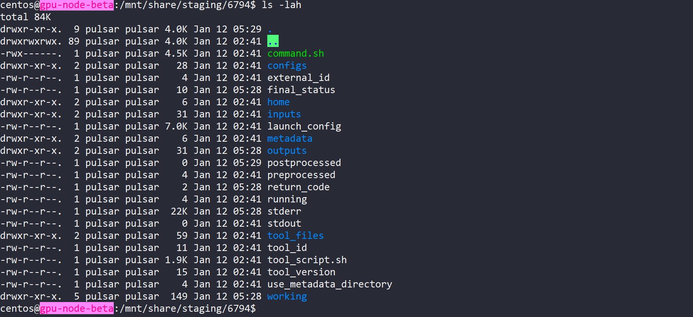
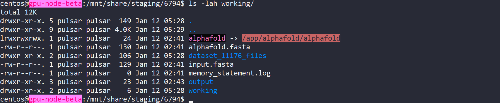
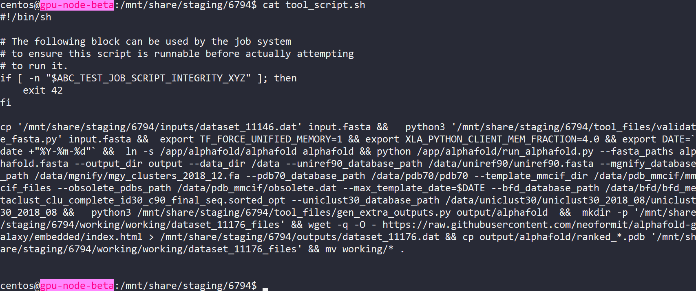
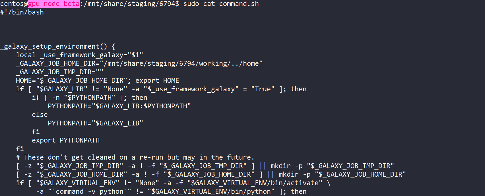
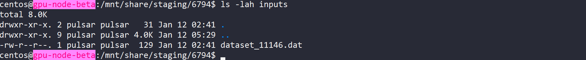
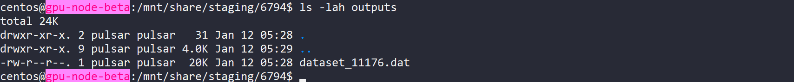
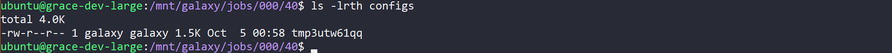
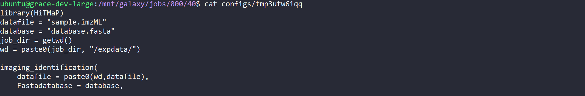
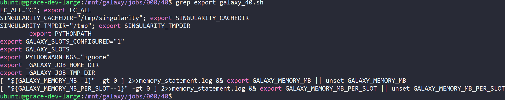

# Tool wrapping: barebones documentation

## Preface

This file is a stripped back, minimal version of the full training material. 
It provides the essentials needed to get started with tool wrapping. 

<br><br>

## Contents
* [Introduction](#introduction)
* [Setup Your Development Environment](#setup-your-development-environment)
* [The Galaxy System](#the-galaxy-system)
* [Galaxy Tool UI]()
* [Tool Wrapping Process]()
* [Getting Help]()

<br><br>

## Introduction

Galaxy's mandate is to bring bioinformatics into the GUI era. Galaxy has become a major platform where people can do bioinformatics (even complex analysis pipelines and workflows) without using the command line or writing scripts. By providing a GUI, galaxy will open the door for countless researchers and hopefully the general public to get involved with bioinformatics and to run their analysis. 

Tool Wrapping is the process of making a tool runnable on galaxy. This includes understanding the tool's dependencies, command line format (options), writing a galaxy UI tool form, and writing tests to prove it all works. 

<br><br>

## Setup Your Development Environment

To develop tool wrappers, you need a good IDE to write xml and search, and a system to test the wrappers you have built. <br>
***Visual studio code*** is recommended for wrapper development, and ***planemo*** is recommended to test your work. 

### IDE

VSC is highly recommended
- Has a Galaxy extension (ext name: 'Galaxy Tools')
    - Provides code snippets (to make boilerplate tool, write gx-tool and select)
    - Tag and attribute auto-completion 
    - Documentation on hover
- Allows searching for use-cases or examples in tool xml:
    - Clone the [tools-iuc github](https://github.com/galaxyproject/tools-iuc)
    - Open the cloned repo with vsc
    - Use the search tool (left side nav button) for something you want to see an example of
    - Example: searching 'type="data_collection"' will show you examples of data_collections in use in tools-iuc

<br>

### Planemo

https://planemo.readthedocs.io/en/latest/

Planemo allows you to check and test your wrapper. <br>
There are 3 main functions to discuss: lint, test, serve. 

**Installation**

```
# create env for planemo
python3 -m venv planemo

# load that env
$ source planemo/bin/activate

# install planemo into env
pip install planemo
```

DO NOT INSTALL PLANEMO USING CONDA IT DOESN'T WORK. ONLY PIP.

**planemo serve**

https://planemo.readthedocs.io/en/latest/commands/serve.html?highlight=serve

The first command to use is 'serve'. This command runs a containerised galaxy instance and serves it on localhost:9090. planemo serve is useful because it loads tool xml files and presents them as on a real server, so we can look at the wrapper UI we are currently working on. 

To use, navigate to a folder containing a tool xml file.
Execute the following:

```
planemo serve
```

It will take some time, but eventually will build galaxy and serve on localhost:9090. Look in the galaxy tools panel on the left side of your screen - you should see the tool you are working on. 

If the tool UI doesn't look right, make your change in the tool xml file, then refresh localhost:9090. The change should have been reflected in the running galaxy instance.  

**planemo lint**

https://planemo.readthedocs.io/en/latest/commands/lint.html?highlight=lint

The 'lint' command tests whether the tool xml violates any rules.
For example, each tool xml needs tests. If no tests are found in the xml, planemo will report it and fail the linting process.

To test, navigate to a folder containing a tool xml file.
Execute the following:  

```
planemo lint [tool_xml_file]
```

This will report any errors with the xml. These errors need to be addressed before submission. 

**planemo test**

https://planemo.readthedocs.io/en/latest/commands/test.html?highlight=test

Planemo test allows you to run tool xml tests and verify they pass. 
This is probably the most important command. 

To run tool tests, navigate to a folder containing a tool xml file.
Execute the following:  

```
planemo test [tool_xml_file]
```

This will read, then execute the tests you have specified within the `<tests>` tag in `tool_xml_file`. 

Note: 

Tool requirements need to already be installed when running planemo test. <br>
For example if you are wrapping the 'quast' tool, create and activate a conda environment for your development, and install 'quast' into that env. Then when you run `planemo test quast.xml`, the quast software will be available. This is actually similar to what happens when a job is run on galaxy. 

If you are using a container for tool execution, supply the `--mulled-containers` option when running `planemo test`.

<br><br>


## The Galaxy System

### Overview

https://training.galaxyproject.org/training-material/topics/admin/

Galaxy is a complex system. For tool wrapping, we can mostly ignore how a galaxy instance is configured, but there are a few things which need to be touched on. These are: 
- Job destinations
- Job execution, and 
- Datasets in galaxy

<br>

### Job Destinations

https://training.galaxyproject.org/training-material/topics/admin/tutorials/job-destinations/tutorial.html
https://docs.galaxyproject.org/en/latest/admin/jobs.html

Job destinations specify 'where' a job is run. It mostly concerns the configuration of a environment where the tool is actually executed. 

As an example, we may specify that one of our destinations has the following: 
- 4 cores
- 16 Gb RAM
- Uses conda to load packages

Any tools which are set to use this 'job destination' will be executed on a node which has those specifications.

Job destinations are mainly the realm of Galaxy Admins, so we usually don't have to worry about it. There are a few instances where it matters though:
- large computational resource requirement (resources)
- tool uses a container (containers)


**Resources**

If we have wrapped a tool which is for large genome assembly, we should communicate with the Galaxy Aus Admin that they should set up a job destination with many cores and heaps of RAM. They will install the tool we wrapped, create a destination with those resources, then will map the tool to use this destination.  

There is nothing to write in terms of the wrapper, and it doesn't affect the dev process, but for actual implementation its important to communicate the typical resource needs of the tool.

**Containers**

By default, Galaxy uses conda to resolve dependencies. If the tool you are wrapping is quast, you need to specify quast as a requirement in the xml. At runtime, Galaxy will then use conda to get the quast conda package you specified and install it, then it will execute the code in the xml `<command>` section.

For containers this is not the case. To actually use a container as a dependency (ie you're running the tool using an image), a job destination has to be set up to use containers. Again, this is the realm of Galaxy Admins, but it applies when developing the wrapper. For example, to run planemo test to check your wrapper, it wont pull the container you specified unless you provide the `--mulled_containers` option to `planemo test`. 

<br>

### Job Execution

An important distinction to highlight is the difference between a Galaxy 'Job', and tool 'execution'. A Galaxy Job includes a large amount of metadata, reporting, dataset handling, and creating an environment where the tool can actually run. The actual tool is executed within the Job at a specific stage, after all the Job setup tasks are complete, and before the outputs are returned. 
 
Galaxy creates a sandbox environment for each job. Aside from creating an environment, installing dependencies, and setting environment variables, this sandbox environment includes a base folder system for the job. Inside this folder system are the files and folders needed for tool execution, once everything has been set up.

It is very useful to check this folder when things aren't working. In this section we will talk about the main files and folders of interest.

**Job home directory**



This is the folder that ***Galaxy*** sees when it is running a job. It is the base folder and contains everything needed to run that job. This acts as a parent folder since it holds all the files and folders needed. The tool itself doesn't actually need to see most of these, so tool execution actually occurs in the `working/` folder. 

**Workdir**



The `working/` folder is where the tool actually runs. Anything in the `<command>` section of the tool xml is templated into a string, then that string is run using the `working/` folder as the home directory. 

If you write `echo "hi" > hello.txt` in the `<command>` section of the tool xml, a file called `hello.txt` will appear in the `working/` directory. This is where the commands are run. 

From the above (first command), we see that the tool which was run produces a single folder called `expdata/` when running. Inside `expdata/` (second command) we have some outputs like a fasta database and some mass spec data.

**Scripts**



`tool_script.sh` contains the command line string you specified in the `<command>` section of the tool xml. It has now been templated by cheetah, and so has be condensed down to what will actually be run by the OS. Something to note here is that there are a lot of `.dat` files -> this relates to how Galaxy stores datasets. More on this below.   



There is another script file, generally called `command.sh` or `galaxy_[job_id].sh`. This script does everything else needed to run the job. If you actually look inside this file, you will see that this script actually sets up all the folders, files, dependencies and environment variables to create the job sandbox.  We don't often need to check this file, but if you want to know about the sandbox environment the tool is running in, all that info is plain to see in `galaxy_[job_id].sh`. As an example,if your tool uses a singularity container and you want to see how the bind paths were set up, all this information would be in `galaxy_[job_id].sh`

**Inputs**



The `inputs/` folder contains the input files which are needed for the job. This will include any data from the user history which was specified for use in the tool form. The actual name of the file from the user history has been replaced with the .dat file stored on disk by the Galaxy database. 

**Outputs**



The `outputs/` folder contains the output files which have been collected. These are specified in the tool xml in the `<outputs>` section. Imagine that Galaxy finds these files and stages them in the `outputs/` folder before moving them to the user history.  

Depending on Galaxy setup, `outputs/` may also contains the tool `stderr` and `stdout`. These are captured when the tool is running, and will be the same as you would see on your console if running the tool locally. If not, `stderr` and `stdout` will be in the Job home directory. 

**Configfiles**




The `config/` folder contains each `<configfile>` in the `<configfiles>` section of the tool xml. Configfiles are also templated by cheetah in the same manner as the `<command>` section, so when they appear in the `config/` folder, they are the plain text file which will can actually be run or used by the tool. 

Similar to checking `tool_script.sh` to find how the tool is executed on the command line, checking the files in `config/` shows you how your configfiles actually ended up after all the variables and logic was assessed. 

**environment variables**

Aside from files and folders, environment variables are set in the job sandbox. Many link to reserved variables which can be written in the tool xml, like `$__tool_directory__` which allows you to access files in the tool wrapper directory. An example of its use is placing small python programs which transform the tool output, or validate files into the tool wrapper directory, next to the tool xml. These programs would then be accessible at `$__tool_directory__/your_python_file.py` 

See https://docs.galaxyproject.org/en/latest/dev/schema.html#reserved-variables for the full list of reserved variables. 

All the non-reserved environment variables are set in `galaxy_[job_id].sh`. <br> An example is seen below, where some singularity and galaxy env variables are exported.  



<br>

### Datasets

All user and shared data in Galaxy is stored as `.dat` files. <br>
It doesn't matter if the file is a textfile, a tsv, a genome index, or a fasta. All data is stored in the data directory of the Galaxy server itself, at a seemingly random location. 

When you upload a file to your history called `myfasta.fasta`, the file is stored as `.dat` in the Galaxy file system, then just creates a listing in its database which maps your credentials, the history, and the file id to the underlying data file it just stored. 

This structure means that when you run a tool on `myfasta.fasta` from your history, Galaxy decodes where that actual file is, and ships it to the `inputs/` folder of the Job sandbox. 

For this reason, you are not meant to interact with the data directory at all. When running a job, all relevant files have already been stage in the job `inputs/` folder ready for use. The names of these files don't even matter, as they are mapped to `$variable_name` you specified for that input in the tool xml. 

This does have an implication for file types. Many bioinformatics tools will try to check file types at runtime using the file's extension. As the extension of the underlying file is always `.dat`, this often results in a failed job. 

To skirt this, just symlink the input file to a more appropriate name. 
Executing `ln -s $input_reads input.fastq` at the start of the `<command>` section of the tool xml, then running the tool on `input.fastq` will present the file as `input.fastq`, not the random `dataset_11146.dat` filename which Galaxy provided. 

<br><br>

## Galaxy Tool UI

[Tool XML documentation](https://training.galaxyproject.org/training-material/topics/dev/tutorials/tool-integration/slides.html#1)
<br>[Tool dev training material](https://training.galaxyproject.org/training-material/topics/dev/tutorials/tool-integration/slides.html#1)


### Params and Outputs
- Params are what the user sees in the UI
- Outputs are the files we collect and send to the user history
- Use the links above to find out their use. 
- Output collection can be tricky - [provides links]

### Tokens
- tokens are just variables used within the xml. 
- They are used so we don't have to repeat stuff like the 'tool name' or 'tool version' in multiple locations. As an example, setting `@TOOL_NAME@` to 'quast' and `@TOOL_VERSION@` to 5.2.1 using tokens means we can use these tokens in other xml tags. 

### Macros
- Macros are snippets of xml.
- Are used for a number of reasons
- One reason is just for readability. Big sections of XML can be moved to a Macro in the macros.xml file so they don't have to appear in the main XML document. Instead, the macro is injected.
- Another reason is where the same section of xml is used in multiple locations. This is the same motivation as programming - duplication is bad and annoying. Just declare the xml section once as a macro, then inject the macro where it is needed. 

### Command section

**Overview**

- The command section brings everything together and provides the script which will be run to execute the tool. 
- It will refer to each `<param>` and `<output>` you have specified in the XML.
- the command section can be seen as a bash script, with additional features due to the cheetah templating language. 

**Cheetah basics**

https://cheetahtemplate.org/users_guide/intro.html<br>
https://pythonhosted.org/Cheetah/<br>
https://docs.galaxyproject.org/en/latest/dev/schema.html

The `<command>` section allows cheetah expressions. Cheetah is a templating language which permits useful features like conditional logic and variable injection. If we sometimes want to produce an extra history output when the tool is run, we might see something like the following: 

```
#if $should_produce_summary:
    cut -f1,4,5,6 output.sam > summary.tsv &&
end if
```

This will see if the `$should_produce_summary` param was `true`. This will most likely be a `type="boolean"` param, which presents itself as a on/off check button in the tool form UI.  If the user has this checked, it will execute the code on the line below to produce a summary file. The `&&` is just so that we can execute another statement after this, which is often necessary as most tool wrappers execute multiple statments. 

The best way to learn cheetah and its use in tool xml is to search tools-iuc. Example: if you want to see how a cheetah function is declared, seach '#def ' in the tools-iuc repo. Any tool declaring a cheetah function will appear, giving you a bunch of use-cases to learn from. 

**Preprocessing**

- Before the actual tool is run, preprocessing is often needed
- This may be to symlink files, to echo text, or to format a user input. 
- It is common to see something like the following:

```
# preprocessing
export LC_ALL=C && kraken --version &&
if [ -d '${kraken_database.fields.path}/${kraken_database.fields.name}' ]; then export KRAKEN_DEFAULT_DB='${kraken_database.fields.path}/${kraken_database.fields.name}'; else export KRAKEN_DEFAULT_DB='${kraken_database.fields.path}'; fi &&

# tool execution
kraken --threads \${GALAXY_SLOTS:-1} ...&&

# extra outputs created by a python script
python kraken_taxonomy_report.py ...
```

The above was taken from the `kraken` tool. We set an environment variable, then created the kraken_database path using some bash conditional logic. 

**Tool execution**

**Postprocessing**

**Tricky Cases**

**Best-practises**

### Configfiles

### Metadata

**Tool Name and Version**

**Citations**

**Help**

<br><br>

## Tool Wrapping Process
### Before You Wrap
**Searching for Wrappers**
**Identifying time-consuming tools**
### Process
### Submission
**toolshed**
**tools-iuc**
### Post-wrapping tasks

<br><br>

## Getting Help

